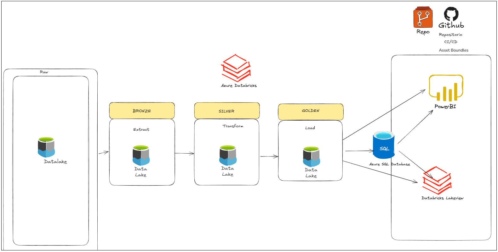

# ANALISIS DE BD DE PELICULAS EN EL TIEMPO
---
**Proyecto de Ingeniería de Datos en Databricks - SmartData**
<hr>

## Descripción
Pipeline automatizado de datos para análisis de PELICULAS en el tiempo con arquitectura de tres capas y despliegue continuo.
<hr>


## Arquitectura

---
## 📁 Estructura del Proyecto

```
CICDSMARTDATAPROYECTO/
│
├── 📂 .github/
│   └── 📂 workflows/
│       └── 📄 deploy_dev_to_prod_databricks.yml   # Pipeline CI/CD deploy a certification workspace databricks
├── 📂 Proceso/
│   ├── Ingest_FilmDetails.py  # Bronze layer
│   ├── Ingest_PosterPath.py   # Bronze Layer
│   ├── Ingest_movies.py       # Bronze Layer
│   ├── Transform.py           # Silver Layer
│   └── Load.py                # Gold Layer
├── 📂 Scripts/
|   ├── Preparacion_Ambiente.py    # Create Schema, Tables, External location
|   └── Conexion-AzureSQL-Proj.py  # Conexión BD Azure SQL
├── 📂 Seguridad/
|   ├── Grants-Users-Groups.py  # Sql Grant
├── 📂 Reversion/
|   ├── Drop-revoke-proyecto.py   # Revoke permissions
├── 📂 dashboards/                    
|   ├── Dashboard_Movies.pdf           # Exportado PDF del Power BI
|   ├── Peliculas- Movies.pdf          # Exportado PDF del Dashboard Databricks
|   └── Peliculas- Movies.lvdash.json  #Exportado JSON del Dashboard Databricks
├── 📂 Datasets/ 
|   ├── FilmDetails.csv   # Fuente Dato 1
|   ├── Movies.csv        # Fuente Dato 2
|   └── PosterPath.csv    # Fuente Dato 3
└── 📄 README.md
```

### Capas del Pipeline

<table>
<tr>
<td width="33%" valign="top">

#### 🥉 Bronze Layer
**Propósito**: Zona de aterrizaje

**Tablas**: 
- `filmdetails` 
- `movies` 
- `posterpath`

**Características**:
- Datos tal como vienen de origen
- Timestamp de ingesta
- Preservación histórica
- Sin validaciones

</td>
<td width="33%" valign="top">

#### 🥈 Silver Layer
**Propósito**: Transformaciones

**Tablas**:
- `movies_transformed`

**Características**:
- Star Schema
- Datos normalizados
- Validaciones completas

</td>
<td width="33%" valign="top">

#### 🥇 Gold Layer
**Propósito**: Analytics-ready, agrupaciones

**Tablas**:
- golden_movies_partitioned : Peliculas agrupados por años en duración, ingresos, presupuesto, record, votos,etc


**Características**:
- Pre-agregados
- Optimizado para BI
- Performance máximo
- Actualizaciones automáticas

</td>
</tr>
</table>

## 🛠️ Tecnologías

<div align="center">

| Tecnología | Propósito |
|:----------:|:----------|
|  | Motor de procesamiento distribuido Spark |
|  | Storage layer con ACID transactions |
|  | Framework de transformación de datos |
|  | Data Lake para almacenamiento persistente |
|  | Automatización CI/CD |
|  |  Visualización |
|  |  Visualización |

</div>

---
